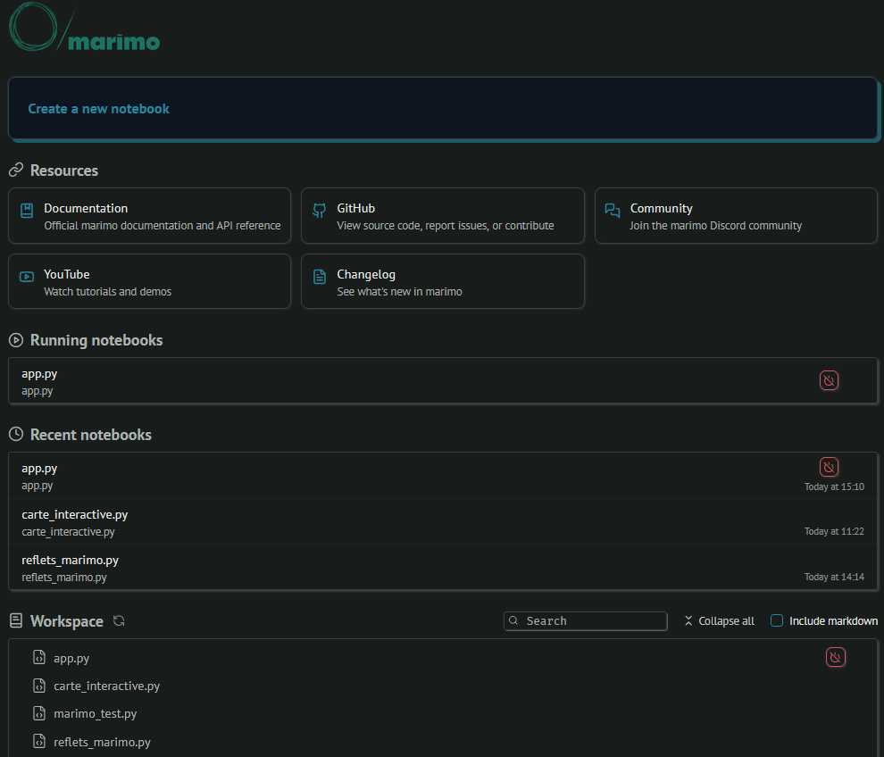
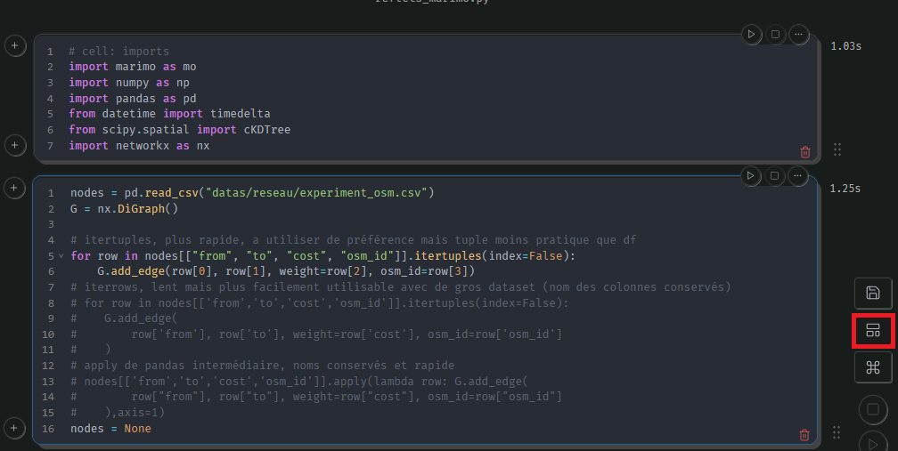

# Reflets optimisation     Jumeau Numérique de la BSPP !

Voici le projet <a href='https://github.com/DavidAdmete/Reflets'>reflets optimisation</a> pensé pour tourner sur l'environnment BSPP.

Acutellement le projet est encore WIP.

Aujourd'hui il utilise marimo pour avoir un environnement propre et une première interface facile à mettre en place.

Pour installer, ne pas oublier d'installer la librairie libomp sur votre ordinateur.

Lancer les commandes suivantes dans le dossier de votre choix : 

<pre>
<code>
git clone https://github.com/Radort78/Reflets-bspp.git
cd Reflets-bspp/
conda create -n reflets_env python=3.13
conda activate reflets_env
python -m pip install -r requirements.txt
marimo edit
</code>
</pre>

Aujourd'hui 3 notebooks existent : 

    |app.py # La version complète, est pensé comme l'application finale
    |carte_interactive.py # Contient le code de la partie paramétrage
    |reflets_marimo.py # Contient la simulation et les différents éléments pour son fonctionnement

Une fois dans l'environnement vous pouvez explorer.

Le boutton entouré en rouge permets de passer en mode applications.

Pour lancer la simulation il faut la lancer à partir du bouton <button>Simulation</button>

Pour les travaux en cours que nous vous expliquerons lors des réunions : 

    COVA différenciée en fonction des périodes de l’année
    Règles d’engagement
    Statuts
    Indicateurs COUVOPS
    Connexion avec SIGTAO
    Sollicitation des SDIS
    Sollicitation des détachements isolés
    Calques en fonction des situations (terro, crues…)

 

