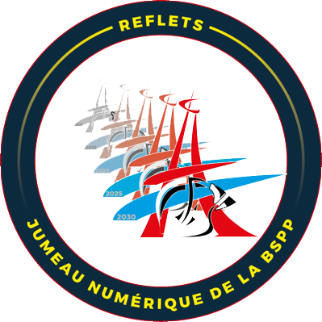

# Reflets optimisation     Jumeau Numérique de la BSPP !

Voici le projet reflets optimisation</a> pensé pour tourner sur l'environnment BSPP.

Acutellement le projet est encore WIP.

Aujourd'hui il utilise marimo pour avoir un environnement propre et une première interface facile à mettre en place.

Le temps de simulation est d'environ 0.6 s par jour simulé, et le simulateur fait preuve d'une grande fiabilité.

 

